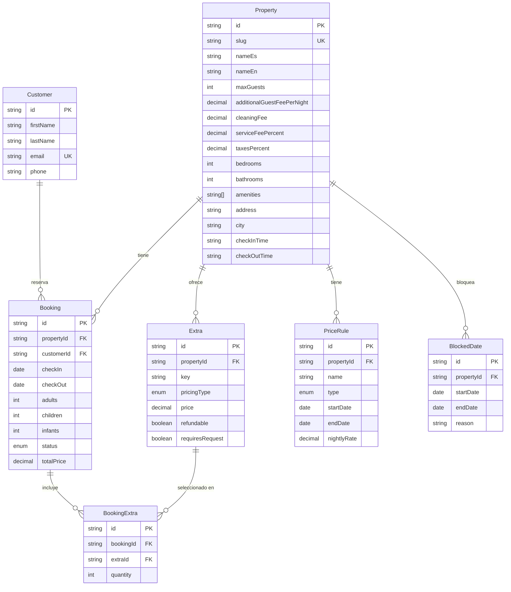

# Base de datos — Fase 3

`apps/api` (NestJS) + PostgreSQL 16 vía Prisma. Alcance: exactamente los 6 modelos
que pide `docs/migration-plan.md` Fase 3 (`Property`, `Availability` → `BlockedDate`,
`Booking`, `Customer`, `Extra`, `PriceRule`), más una tabla de join
(`BookingExtra`). **Sin `User`/`Role` (Fase 4) ni `CMSPage`/`SiteSettings`/`Gallery`/`FAQ`
(Fase 5)** — esas tablas no existen todavía, a propósito.

## Diagrama ER



## Decisiones de modelado

- **Una sola `Property`** — sin tabla `Room` ni inventario por habitación (ver
  `docs/domain-decisions.md`, "fuera de alcance").
- `cleaningFee`/`serviceFeePercent`/`taxesPercent` viven en `Property`, no en un
  modelo aparte — no estaban en la lista explícita de `migration-plan.md` pero son
  necesarios para reproducir el cálculo de `buildQuote()` server-side (ver
  sección "Endpoint de quote" abajo). Si en el futuro varían por temporada, se
  moverán a `PriceRule`.
- `PriceRule.type` soporta `LOW | HIGH | WEEKEND` (base/temporada alta/fin de
  semana, per `domain-decisions.md`), pero **solo se sembró la tarifa base**
  (`LOW`, $300/noche, dato real del listing). No hay tarifas de fin de semana o
  temporada alta sembradas — no hay ningún número real para esos valores en
  `datos.json` ni en `domain-decisions.md`, e inventar un multiplicador
  violaría "datos reales, no ficticios". Cuando el negocio defina esos números,
  se agregan como filas adicionales de `PriceRule`; el endpoint de quote
  seguirá funcionando (usa `LOW` como tarifa activa) hasta que se implemente
  selección de tarifa por fecha (trabajo de Fase 6, calendario/reservas).
- `Extra.key` usa los mismos identificadores que
  `packages/types/src/domain/extra.ts` (`ExtraKey`) y que
  `apps/web/lib/property-data.ts` (`"heated-pool"`) — mismo vocabulario en
  cliente, tipos compartidos y base de datos.
- `BookingExtra` como tabla de join (en vez de un array) porque `quantity` y la
  relación con `Booking`/`Extra` necesitan sus propias filas — un `Booking` con
  mascota + huésped adicional, por ejemplo.

## Endpoint de quote — `POST /properties/:slug/quote`

Reemplaza el cálculo client-side de `buildQuote()` (`apps/web/lib/booking.ts`)
por uno server-side (`apps/api/src/properties/properties.service.ts`), usando
la misma fórmula pura (`computeQuote()` en `packages/shared/src/pricing.ts`, sin
DB ni framework) para que ambos lados no puedan divergir en silencio.

```
POST /properties/areia-bela/quote
{
  "checkIn": "2026-08-10",
  "checkOut": "2026-08-14",
  "guests": { "adults": 2, "children": 0, "infants": 0 },
  "extraIds": ["heated-pool"]
}
```

**Verificación del criterio de salida** ("el quote server-side coincide con la
UI actual"): en su momento `apps/web/scripts/verify-quote-parity.ts` corría la
`buildQuote()` del cliente y la `computeQuote()` del servidor con los mismos
casos y comparaba los números. Los cuatro coincidían (`total=1620`, `1700`,
`2885`, `495`).

Ese script **ya no existe**: el cliente dejó de calcular el precio y ahora pide
la cotización al API, así que no hay dos implementaciones que puedan divergir.
La paridad pasó de comprobarse a ser estructural. Ver `docs/changelog.md`.

**Actualización — probado end-to-end contra una Postgres real** (después de que
nos dieras credenciales de una instancia accesible desde este entorno,
`127.0.0.1:5432`): migración aplicada (`prisma migrate deploy`), seed corrido
(dos veces, confirmando que el `upsert` es idempotente), servidor Nest real
levantado (`ts-node --transpile-only src/main.ts`) y el endpoint HTTP golpeado
de verdad con `curl`:

```
$ curl -s -X POST http://localhost:3001/properties/areia-bela/quote \
  -H "Content-Type: application/json" \
  -d '{"checkIn":"2026-08-10","checkOut":"2026-08-14","guests":{"adults":2,"children":0,"infants":0},"extraIds":["heated-pool"]}'
{"nights":4,"pricePerNight":300,"extras":[{"id":"heated-pool","label":"Heated pool","pricePerNight":20,"total":80}],"subtotal":1200,"extrasTotal":80,"cleaningFee":120,"serviceFee":144,"taxes":156,"total":1700}

$ curl ... extraIds:[] ...
{"nights":4,...,"total":1620}

$ curl -X POST .../properties/no-existe/quote ...   -> 404
$ curl -X POST .../properties/areia-bela/quote -d '{"checkIn":"no-es-fecha",...}'   -> 400
```

`total: 1700` y `total: 1620` son exactamente los mismos números que producía
la UI cuando calculaba por su cuenta — confirma que el `Controller` →
`ValidationPipe`/DTO → `Service` → `PrismaService` → Postgres → `computeQuote()`
completo funciona y sigue coincidiendo con la UI. 404 para propiedad
inexistente y 400 para input inválido, ambos correctos.

**Bug real que encontré y corregí en el proceso:** `nest build` calculaba mal
el `rootDir` de salida (`dist/api/...` en vez de `dist/...`) porque
`prisma/seed.ts` importa `../../web/datos.json` — TypeScript usaba eso para
inferir la raíz común. Solucionado con `apps/api/tsconfig.build.json` (excluye
`prisma/**` del build de la app) + `nest-cli.json` apuntando a ese tsconfig.

**Limitación real que queda, no resuelta todavía:** `node dist/main.js`
(el output compilado de `nest build`) **no arranca** — Node no puede resolver
`@areia-bela/shared` en tiempo de ejecución porque ese paquete (y
`utils`/`types`/`ui`) son TS fuente sin build propio
(`"main": "./src/index.ts"`), y el loader ESM nativo de Node no resuelve el
`export * from "./constants"` sin extensión dentro de ese paquete. Funciona
con Next.js (Turbopack/webpack) y con `ts-node` (resolución estilo CommonJS,
auto-resuelve extensiones) pero no con Node corriendo JS compilado
directamente. Por eso `apps/api/package.json` usa `ts-node --transpile-only`
tanto para `dev` como para `start` en vez de `node dist/main.js` — funciona
igual de bien hoy, pero significa que `packages/{utils,types,shared,ui}`
necesitan un paso de build real (p. ej. `tsup`) antes de un despliegue de
producción de verdad. Anotado como pendiente, no bloquea Fase 3.

## Migraciones y seed — verificado contra Postgres real

`prisma/schema.prisma` validado offline (`prisma validate`), cliente generado
offline (`prisma generate`), migración inicial generada con
`prisma migrate diff --from-empty --to-schema-datamodel ... --script` (no
escrita a mano) y luego **aplicada de verdad** con `prisma migrate deploy`
contra la instancia en `127.0.0.1:5432`. `prisma/seed.ts` corrido dos veces
seguidas sin error (upsert idempotente) — datos verificados por consulta
directa:

```
slug=areia-bela maxGuests=8 cleaningFee=120.00
extras: additional-guest($30/night), certified-nanny($20/hour),
        heated-pool($20/night), pet($100/stay)
priceRule: "Tarifa base" LOW $300/night
blockedDate: 2026-12-24..2026-12-26 "Ejemplo para testing del calendario"
```

Criterio de salida de Fase 3 ("el quote server-side coincide con la UI
actual"; "seed corre limpio desde cero") cerrado de verdad, no solo en
apariencia.
