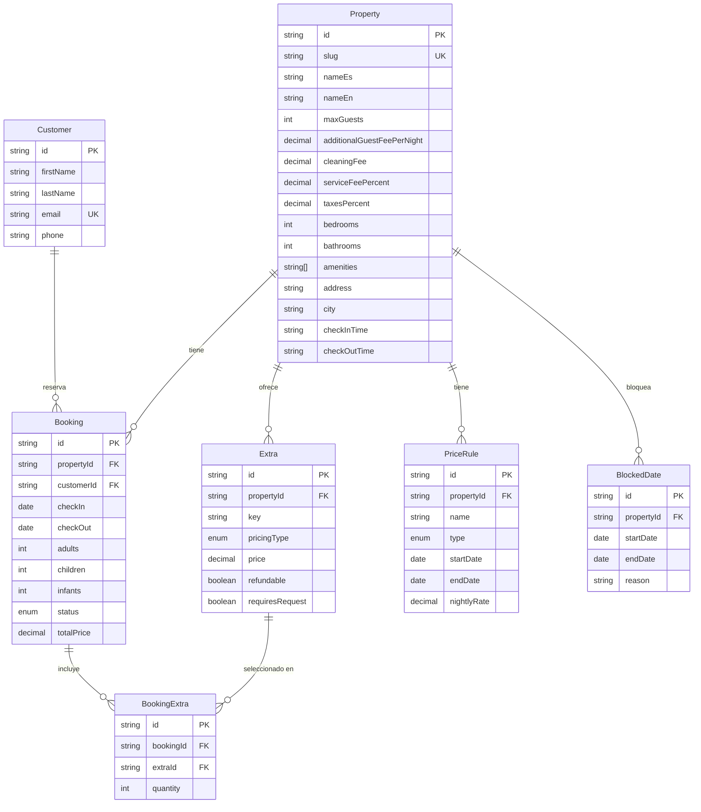

# Base de datos — Fase 3

`apps/api` (NestJS) + PostgreSQL 16 vía Prisma. Alcance: exactamente los 6 modelos
que pide `docs/migration-plan.md` Fase 3 (`Property`, `Availability` → `BlockedDate`,
`Booking`, `Customer`, `Extra`, `PriceRule`), más una tabla de join
(`BookingExtra`). **Sin `User`/`Role` (Fase 4) ni `CMSPage`/`SiteSettings`/`Gallery`/`FAQ`
(Fase 5)** — esas tablas no existen todavía, a propósito.

## Diagrama ER



## Decisiones de modelado

- **Una sola `Property`** — sin tabla `Room` ni inventario por habitación (ver
  `docs/domain-decisions.md`, "fuera de alcance").
- `cleaningFee`/`serviceFeePercent`/`taxesPercent` viven en `Property`, no en un
  modelo aparte — no estaban en la lista explícita de `migration-plan.md` pero son
  necesarios para reproducir el cálculo de `buildQuote()` server-side (ver
  sección "Endpoint de quote" abajo). Si en el futuro varían por temporada, se
  moverán a `PriceRule`.
- `PriceRule.type` soporta `LOW | HIGH | WEEKEND` (base/temporada alta/fin de
  semana, per `domain-decisions.md`), pero **solo se sembró la tarifa base**
  (`LOW`, $300/noche, dato real del listing). No hay tarifas de fin de semana o
  temporada alta sembradas — no hay ningún número real para esos valores en
  `datos.json` ni en `domain-decisions.md`, e inventar un multiplicador
  violaría "datos reales, no ficticios". Cuando el negocio defina esos números,
  se agregan como filas adicionales de `PriceRule`; el endpoint de quote
  seguirá funcionando (usa `LOW` como tarifa activa) hasta que se implemente
  selección de tarifa por fecha (trabajo de Fase 6, calendario/reservas).
- `Extra.key` usa los mismos identificadores que
  `packages/types/src/domain/extra.ts` (`ExtraKey`) y que
  `apps/web/lib/property-data.ts` (`"heated-pool"`) — mismo vocabulario en
  cliente, tipos compartidos y base de datos.
- `BookingExtra` como tabla de join (en vez de un array) porque `quantity` y la
  relación con `Booking`/`Extra` necesitan sus propias filas — un `Booking` con
  mascota + huésped adicional, por ejemplo.

## Endpoint de quote — `POST /properties/:slug/quote`

Reemplaza el cálculo client-side de `buildQuote()` (`apps/web/lib/booking.ts`)
por uno server-side (`apps/api/src/properties/properties.service.ts`), usando
la misma fórmula pura (`computeQuote()` en `packages/shared/src/pricing.ts`, sin
DB ni framework) para que ambos lados no puedan divergir en silencio.

```
POST /properties/areia-bela/quote
{
  "checkIn": "2026-08-10",
  "checkOut": "2026-08-14",
  "guests": { "adults": 2, "children": 0, "infants": 0 },
  "extraIds": ["heated-pool"]
}
```

**Verificación del criterio de salida** ("el quote server-side coincide con la
UI actual"): `apps/web/scripts/verify-quote-parity.ts` ejecuta la
`buildQuote()` real del cliente y la `computeQuote()` real del servidor con los
mismos 4 casos de prueba (distintas fechas, con y sin extra), usando los
mismos números reales de `datos.json`. Corrido y verde en esta sesión:

```
$ npx tsx apps/web/scripts/verify-quote-parity.ts
OK   {"checkIn":"2026-08-10","checkOut":"2026-08-14","extraIds":[]} -> total=1620
OK   {"checkIn":"2026-08-10","checkOut":"2026-08-14","extraIds":["heated-pool"]} -> total=1700
OK   {"checkIn":"2026-12-24","checkOut":"2026-12-31","extraIds":["heated-pool"]} -> total=2885
OK   {"checkIn":"2026-09-01","checkOut":"2026-09-02","extraIds":[]} -> total=495

Todos los 4 casos coinciden entre buildQuote() (cliente) y computeQuote() (servidor).
```

Lo que esto **no** prueba (limitación honesta, no un hueco escondido): el
endpoint HTTP completo (`Controller` → `Service` → `PrismaService` → Postgres)
no se pudo probar end-to-end en esta sesión porque el sandbox de desarrollo no
tiene Docker ni un servidor Postgres local disponible (ver siguiente sección).
Lo que sí está verificado es la fórmula de cálculo en sí — la parte que el
audit original señalaba como el riesgo real (precios manipulables /
inconsistentes entre cliente y servidor). El _wiring_ del controller con
`ValidationPipe` + DTOs se revisó manualmente pero no se ejecutó contra una
DB real.

## Migraciones y seed — limitación del entorno, léela antes de correr nada

**Este sandbox no tiene Docker ni un binario de servidor PostgreSQL instalado**
(sí hay cliente `psql`, pero no `postgres`/`initdb`/`pg_ctl`, y no hay sudo sin
contraseña para instalarlo). Por eso no pude ejecutar `prisma migrate dev` ni
`prisma db seed` contra una base de datos real en esta sesión. Lo que sí hice,
y es real:

- `prisma/schema.prisma` — validado offline con `npx prisma validate` (pasa).
- `prisma generate` — corrido offline, genera el Prisma Client sin errores.
- `prisma/migrations/<timestamp>_init/migration.sql` — **no escrito a mano**:
  generado con `prisma migrate diff --from-empty --to-schema-datamodel
prisma/schema.prisma --script`, la forma soportada por Prisma de producir el
  SQL de una migración inicial sin conexión a DB. Es el mismo SQL que
  `prisma migrate dev --name init` habría escrito contra una DB real.
- `prisma/seed.ts` — completo, usa datos reales (ver comentario al inicio del
  archivo para las fuentes exactas), pero **no se ejecutó** contra una DB.

**Lo que falta para cerrar el criterio de salida de verdad** ("seed corre
limpio desde cero") — a correr en tu máquina, no en este sandbox:

```bash
docker compose up -d
cp apps/api/.env.example apps/api/.env   # ya existe, con las mismas credenciales dev
pnpm --filter @areia-bela/api prisma:migrate   # aplica la migración generada
pnpm --filter @areia-bela/api seed
```

Si algo falla ahí, avisame — no lo voy a poder reproducir yo mismo sin Docker
en este entorno, pero puedo corregir el schema/seed a partir del error que me
pegues.
